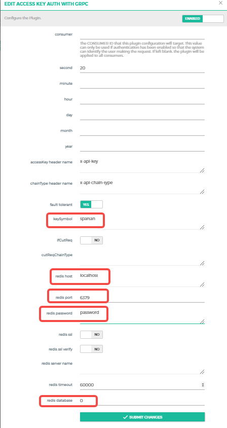

# Data-Center-Gateway

## Introduction

This document is a tutorial for Data Centers to install and configure their own gateways

### Hardware Requirments：

#### Minimum Requirements

- 4 CPU
- Memory: 8GB
- Disk: 50GB SSD

#### Recommended Requirements

- 8 CPU
- Memory: 32GB
- Disk: 100GB SSD

### Prerequisites：

- Redis 6.0.5 or later

### Project Dependencies: 

kong: Kong API gateway

postgresql: database of the gateway

konga: visual configuration web service of the gateway

kong-service: microservice of the gateway

redis: gateway's access key authentication and flow restriction


### Installation: 

Clone the project : 

```shell
git clone https://github.com/BSN-Spartan/Data-Center-Gateway.git
```

Now, the structure of Kong Gateway is shown as below:

```shell
[root@localhost bsn]# tree -L 3 Data-Center-Gateway/
Data-Center-Gateway/
├── docker-compose.yaml
├── kong
│   ├── conf
│   │   ├── kong.conf
│   │   ├── kong.yaml
│   │   ├── nginx_kong.lua
│   │   ├── nginx_kong_stream.lua
│   │   └── start.sh
│   ├── logs
│   │   ├── access.log
│   │   ├── admin_access.log
│   │   ├── error.log
│   │   ├── status_error.log
│   │   ├── tcp_access.log
│   │   └── tcp_error.log
│   └── plugins
│       ├── access-key-auth-with-grpc
│       ├── access-key-auth-with-http
│       └── deck
└── super-kong-service
    ├── config
    │   └── config.yaml
    └── super-kong-service

8 directories, 15 files
```

Grant read/write/execute permissions to `Data-Center-Gateway/kong` and `Data-Center-Gateway/super-kong-service` directories, then execute the following commands: 

```shell
chmod 777 -R Data-Center-Gateway/kong
chmod 777 -R Data-Center-Gateway/super-kong-service
```

Edit `Data-Center-Gateway/super-kong-service/config/config.yaml`: 

##### Example of `config.yaml`: 

```shell
Redis:
  redisHost: 10.0.51.127:6379 // redis_IP:Port  Need to be consistent with the plugin configuration below
  redisPW: "123456"			  // Redis password   Need to be consistent with the plugin configuration below
  redisDb: 0				  // Redis database  Need to be consistent with the plugin configuration below
KeySymbol: "ddc"			  // symbol of the Redis storage key，Needs to be consistent with the keySymbol configured in the plugin below
ServerPort: 18899   		  // microservice API port number
```

Start the gateway by Docker: 

```shell
docker network create kong-net              // Create a Docker network to allow the containers to discover and communicate with each other
docker-compose -f docker-compose.yaml up -d // Start the container
// docker-compose -f docker-compose.yaml down  // Stop the container
```

Import the gateway initialization configuration (**this operation only needs to be performed once after the first start of the gateway and need not to re-import afterwards**):

Access the kong gateway container: 

```shell
docker exec -it super-kong bash
```

Run the command in the container: 

```shell
cd /usr/local/kong/ && deck sync --config /usr/local/kong/kong.yaml
```

The contains has been started: 


### Configuration: 

Initialize konga, open konga in the browser: 

http://[Kong gateway IP]:1337

Register a user: 


After successful registration and login, configure the Kong Admin URL: 


Username: admin(custom) 

URL: http://super-kong:8001

`super-kong` is the container's name of Kong gateway

8001 is the admin_api port of Kong gateway

konga communicates with Kong by Docker's internal virtual network

You can connect to Kong gateway after correctly configuring the parameters above, and then manage the gateway configuration.

The configuration of gateway initialization was imported in prior, Kong gateway can run normally just by adding the upstream configuration and editing the configuration of the plug-in.


##### 1. Configure Upstream


**The chainType in the upstream name must be the same as the one in the user's request path, otherwise the transaction cannot be forwarded properly!**

The upstream name format is (lowercase): chainType + "-" + chainPort 

The upstream name must be configured in this format, and other parameters are optional.

Example: spartanone-rpc


Then, configure Targets in the format of IP:Port

Example: 10.0.51.134:20004

**Targets need to be configured with at least one, which is the address of the node that will ultimately receive the transaction.**


##### 2. Configure Plugins

Plugin name: `access-key-auth-with-http`

Modify the Redis configuration to match the Redis configuration in microservices;

Change keySymbol to match the symbol of Redis storage key in microservices;

Leave other parameters unchanged.


Plugin name: `access-key-auth-with-grpc`

Modify the Redis configuration to match the Redis configuration in microservices;

Change keySymbol to match the symbol of Redis storage key in microservices;

Leave other parameters unchanged.




##### 3. Configure Consumers

Create a user and configure Basic Auth: 

The username and password need to be configured into the operations and maintenance system, and will be used when the system requests the gateway microservice interface.


## Key Configurations: 

1. The Redis configuration in the microservice needs to be consistent with the Redis configuration in the 2 plugins, otherwise it cannot authenticate and limit the flow.

2. The name of the pubic chainType should be consistent with the chainType in the upstream name, otherwise the requests cannot be forwarded to the correct target node

3. When creating the Consumer in the gateway, the username and password of Basic Auth need to be configured to the operations and maintenance system, otherwise the system can not request the gateway microservice interface.

4. For security reason, the port of Kong gateway related management interface is not open, see docker-compose file for more details. The communication between kong, konga and microservices is via Docker's virtual network.

5. Official development documentation of Kong Gateway: https://docs.konghq.com/gateway/2.8.x/


### Public Ports of Kong Gateway: 

18601: http/websocket port

18602: https/websockets port

18603: grpcs port

18605: grpc port


### Key Request Parameters of Kong Gateway: 

Access key: accessKey

Target chain: chainType

Interface type of user requests: chainPort

#### Kong Gateway Request Format: 

##### HTTP Request: 

https://[domain_name:port]/api/[accessKey]/[chainType]/[chainPort]/[path_on_chain]

*Note: `path_on_chain` is optional*

Example: https://spartangate.com:12345/api/015416c06ef74ac38a92521792f97e7d/spartanone/rpc

##### Websocket Request: 

wss://[domain_name:port]/api/[accessKey]/[chainType]/ws/[path_on_chain]

*Note: `path_on_chain` is optional*

Example: wss://spartangate.com:12345/api/015416c06ef74ac38a92521792f97e7d/spartanone/ws

##### grpc Request: 

[domain_name:port]

##### Request Header: 

x-api-key:[accessKey]

x-api-chain-type:[chainType]


### Verification Steps: 

1. Obtain gateway access information in the data center portal.
2. Request the gateway interface in the correct format and verify if the request can be successful.

*Note: Make sure to correctly configure the [accessKey], [chainType] and[chainPort] parameters.*


### Documentation: 

#### Installation and configuration of Redis: 

github: https://github.com/redis/redis

Document: https://redis.io/docs/getting-started/
